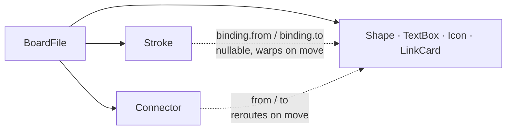

# Data Model

This document defines every object a Stem board contains — its fields, its types, and the rules that govern it. All feature specs reference this document. If something isn't defined here, it doesn't exist in Stem.

The model is stated in TypeScript rather than prose tables. A board is a JSON file, and these interfaces are that file's schema — the type system states precisely what a table would only approximate.

---

## Objects

- [BoardFile](#boardfile)
- [BaseObject](#baseobject)
- [Stroke](#stroke)
- [Shape](#shape)
- [Connector](#connector)
- [TextBox](#textbox)
- [Icon](#icon)
- [LinkCard](#linkcard)

## Primitive types

- [ObjectId](#objectid)
- [Rect, Point](#rect-point)
- [ColorSlot, WeightSlot](#colorslot-weightslot)
- [JSONContent](#jsoncontent)

---

## Storage form

One JSON file per board. No binary format, no database — the whole point is that a board is a small readable file. [Persistence](Features/Persistence.md) governs how that file is written, where it lives, and how it is recovered.

---

## BoardFile

The root of a board file. Everything else in this document is reachable from it.

```ts
interface BoardFile {
  version: 1
  id: ObjectId
  title: string
  createdAt: number
  updatedAt: number
  viewport: { x: number; y: number; zoom: number }  // restored on open
  objects: BoardObject[]
}
```

```ts
type BoardObject = Stroke | Shape | Connector | TextBox | Icon | LinkCard
```

### Rules

- `version` is `1` for every file written by this version of Stem. It exists so a future format change can be detected rather than guessed at.
- `viewport` is saved per board and restored when the board is opened. See [Canvas & Viewport](Features/Canvas%20&%20Viewport.md).
- `objects` is the complete contents of the board. There is no separate index, no layer list, and no grouping structure — `z` on each object carries ordering.

---

## BaseObject

Every object on a board carries these fields.

```ts
interface BaseObject {
  id: ObjectId
  type: string
  bounds: Rect          // cached AABB, recomputed on mutation
  color: ColorSlot      // 1–5
  weight: WeightSlot    // 1–3
  z: number             // creation order; no layer UI in v1
}
```

### Rules

- `bounds` is a cache, not authority. It is derived from the object's own geometry and recomputed on every mutation. Where `bounds` and geometry disagree, the geometry is correct and the cache is the defect.
- `bounds` is what hit-testing, marquee selection, connector anchoring, and export cropping all read. It is the reason whole objects can be hit targets rather than handles — see [Design Principles](Design%20Principles.md) → No aiming.
- `z` is creation order. There is no UI for changing it in v1 and no layer model.

---

## Stroke

A freehand mark. The output of [Draw mode](Features/Drawing.md).

```ts
interface Stroke extends BaseObject {
  type: 'stroke'
  points: [x: number, y: number][]   // simplified, world space
  binding: {
    from: ObjectId | null
    to: ObjectId | null
  }
  originalLength: number             // for the warp/reroute threshold
}
```

### Rules

- `points` holds the **simplified** point array, not the rendered outline. The `perfect-freehand` outline is regenerated at render time so that stroke width can respond to zoom and to weight changes. Storing the outline would freeze both.
- Simplification runs in world space, so the result is zoom-independent. See [Drawing](Features/Drawing.md) → On commit.
- `binding.from` and `binding.to` are set silently at commit time when an endpoint finishes within 24px (screen space) of another object's bounds. A `null` end is unbound.
- `originalLength` is the stroke's arc length at commit. It is the denominator for the warp threshold in [Connectors](Features/Connectors.md) → Path A, and is not updated by subsequent warping.
- When a bound object is deleted, the stroke survives with that end set to `null`. Deletion never cascades to strokes.

---

## Shape

A clean geometric primitive. Produced by `Shift`-drawing, by `Tab` conversion, or from the [insert menu](Features/Insert%20Menu.md).

```ts
interface Shape extends BaseObject {
  type: 'shape'
  kind: 'rect' | 'roundRect' | 'ellipse' | 'triangle' | 'diamond' | 'line' | 'arrow'
  rect: Rect
  rotation: 0                         // reserved, not settable in v1
  fill: 'none' | 'solid'              // solid = background color, for occlusion
  label?: string                      // plain text, centered
}
```

### Rules

- `rect` is the shape's defining box. A shape produced by recognition is snapped to the source stroke's bounding box, not to a grid.
- `rotation` is reserved and always `0`. There is no rotation in v1 — see [Selection](Features/Selection.md).
- `fill: 'solid'` renders the shape in the background color so it occludes what sits behind it. `'none'` is a transparent outline.
- `label` is plain text, centered, and moves with the shape. It is not rich text and is not a [TextBox](#textbox).
- `roundRect` corner radius is 8px at zoom 1.

---

## Connector

A generated connection between two objects. The output of [Connect mode](Features/Connectors.md).

```ts
interface Connector extends BaseObject {
  type: 'connector'
  from: { id: ObjectId } | { point: Point }
  to:   { id: ObjectId } | { point: Point }
  routing: 'curved' | 'orthogonal'
  arrowhead: 'end' | 'both' | 'none'
  label?: string
}
```

### Rules

- An end bound to an object (`{ id }`) anchors at the intersection of the object's bounds with the line between the two ends' centers. It is recomputed on every move — connectors reroute, they never warp.
- `routing` defaults to `'curved'`: a cubic bézier with control points pushed out along the anchor normals. `'orthogonal'` uses 8px rounded corners and is reached by `Tab` cycling on a selected connector.
- A `Connector` and a bound [Stroke](#stroke) are two forms of the same relationship, and `Tab` converts between them in both directions.

---

## TextBox

Rich text, rendered as an HTML overlay rather than drawn to canvas. See [Writing](Features/Writing.md).

```ts
interface TextBox extends BaseObject {
  type: 'text'
  position: Point
  width: number                       // grows in height automatically
  content: JSONContent                // Tiptap document
}
```

### Rules

- `width` is the only dimension stored. Height is a function of the content and the width, resolved at render time by the browser's own layout.
- `content` is a Tiptap document restricted to the marks and nodes listed in [Writing](Features/Writing.md) → Supported marks. A document containing anything outside that set is not produced by Stem.
- A text box whose content is empty is discarded on blur and never reaches the file.

---

## Icon

A single-color glyph placed from the [insert menu](Features/Insert%20Menu.md).

```ts
interface Icon extends BaseObject {
  type: 'icon'
  setId: string
  iconId: string
  position: Point
  size: number
}
```

### Rules

- `setId` and `iconId` reference the pre-built icon index, not a runtime package. The index ships with the app.
- Icons render in the active [color slot](#colorslot-weightslot). They are single-color by construction; multi-color brand logos render in one ink color like everything else.
- `size` is set at placement and changed by scaling the selection. There are no resize handles.

---

## LinkCard

An outbound link to a web page, most often Notion. See [Links](Features/Links.md) and [Integrations — Notion](Integrations/Notion.md).

```ts
interface LinkCard extends BaseObject {
  type: 'link'
  url: string
  style: 'inline' | 'bookmark'
  title: string
  iconUrl?: string
  fetchedAt: number
}
```

### Rules

- `title` and `iconUrl` are a cache of what was fetched from the target, and `fetchedAt` records when. They are refreshed on demand through a context action, never automatically.
- A `LinkCard` is outbound only. Nothing about the target is synchronised into the board beyond these cached display fields.
- The card renders as a pill (`'inline'`) or as a card with title, icon, and domain (`'bookmark'`).

---

## Primitive types

### ObjectId

```ts
type ObjectId = string  // nanoid
```

Every object and every board carries one. Generated client-side; there is no server and no coordination.

### Rect, Point

`Rect` and `Point` are referenced by `BaseObject.bounds`, `Shape.rect`, `TextBox.position`, `Icon.position`, and `Connector`'s free-point ends. Their field shapes are not yet defined.

### ColorSlot, WeightSlot

`ColorSlot` is one of five ink slots and `WeightSlot` one of three stroke weights. The slot is stored, never a resolved color value — which is what allows an existing board to read correctly in both light and dark themes. See [Visual Design](Visual%20Design.md) for the slot values and [Drawing](Features/Drawing.md) for what each weight means.

The numeric range of each type is stated (`1–5`, `1–3`); the type declarations themselves are not yet defined.

### JSONContent

Tiptap's own document type, carried by `TextBox.content`. Stem does not define it; it is imported from Tiptap and its shape is that library's contract.

---

## The graph

Stem's objects form a flat list, not a tree. The only relationships between them are bindings, and both kinds point from a connecting object at the objects it connects.



Both binding kinds are non-identifying: the connecting object outlives what it points at. Deleting a target unbinds the end and leaves the connector or stroke in place. **Nothing in Stem cascade-deletes.**

A `Connector` end may also hold a free `{ point }` rather than an object id, in which case that end binds to nothing and does not move.

---

## Object lifetime

| Event | Effect |
|---|---|
| Object created | Appended to `objects` with the next `z`. Emitted as a command, so it is undoable. |
| Object mutated | Geometry changes, `bounds` recomputed. Continuous operations coalesce into one undo step. |
| Object deleted | Removed from `objects`. Any `Stroke.binding` or `Connector` end referencing it is set to unbound; the referencing object survives. |
| Board saved | The whole `objects` array is written. There is no partial or incremental write — see [Persistence](Features/Persistence.md). |

Every one of these passes through the [command layer](Architecture/Command%20Layer.md). A mutation that does not is a defect, because it is a mutation `Cmd+Z` cannot reach.
